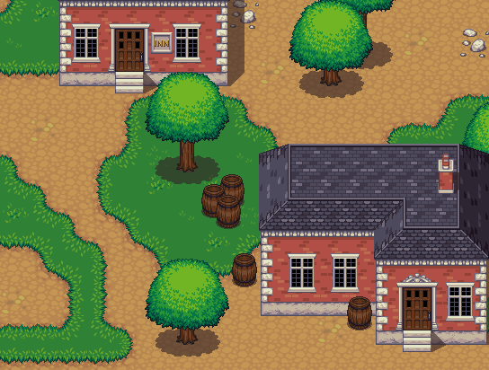
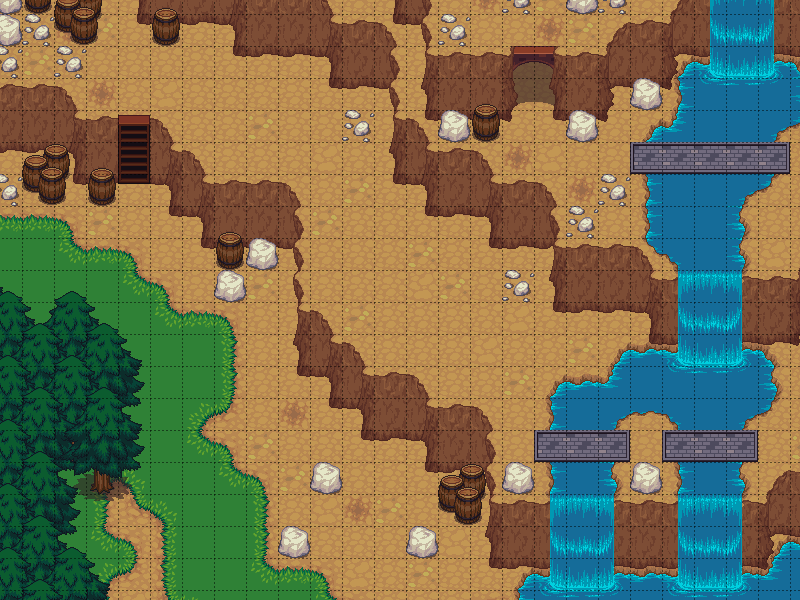

# Liberated Pixel Cup Asset Collection

A collection of FREE 32x32 pixel game graphics. (Under both CC-BY-SA-4.0 *and* GPL-3.0 licenses.) They are mostly collected and categorized from entries to the ["Liberated Pixel Cup" event](https://lpc.opengameart.org) by the [OpenGameArt.org community](https://opengameart.org). The assets contain all graphics needed for a full game: characters, clothes, weapons, terrains, buildings, furniture, and much more.

 

*Screenshot from the ["Liberated Pixel Cup" event](https://lpc.opengameart.org) homepage*

## Initial, very incomplete version!

Please be aware that this version is still extremely incomplete, but will grow in the next versions.

This is not just a collection of random asset files, but the efford to bring the jungle of awesome but *very unstructured* asset submissions into a cohesive and dependable structure.
A long running, semi-anarchistic project like the Liberated Pixel Cup breeds creativity - and chaos.
Sorting that chaos and making it usable for game developers is the goal of this collection. 

Give me some time. :) 

## License and Contribution

All graphical assets in this collection are dual-licensed under *both* of these licenses:

- [Creative Commons BY-SA 4.0](https://creativecommons.org/licenses/by-sa/4.0/)
    Notice: The original Liberated Pixel Cup entries were licensed under CC BY-SA 3.0. The assets in this collection are licensed under version 4.0 (or later) in accordence with the [Creative Commons license compatibility rules](https://wiki.creativecommons.org/wiki/ShareAlike_compatibility).
- [GPL 3.0](https://www.gnu.org/licenses/gpl-3.0.html.en)

`SPDX-License-Identifier: CC-BY-SA-4.0 AND GPL-3.0-only`

A few additional assets were added to the collection that the authors released under a public domain license. Since I don't have a list of those (yet) you should assume all assets to be under the licenses above.

### Contributing

Contributions are welcome!
Please keep in mind these two caveats: 
All assets **have to** be licensed under *both* of the licenses above (or a public domain license that allows redistribution under the licenses above).
All graphical assets in this set **have to** follow the [Liberated Pixel Cup styleguide](https://lpc.opengameart.org/static/LPC-Style-Guide/build/styleguide.html).
